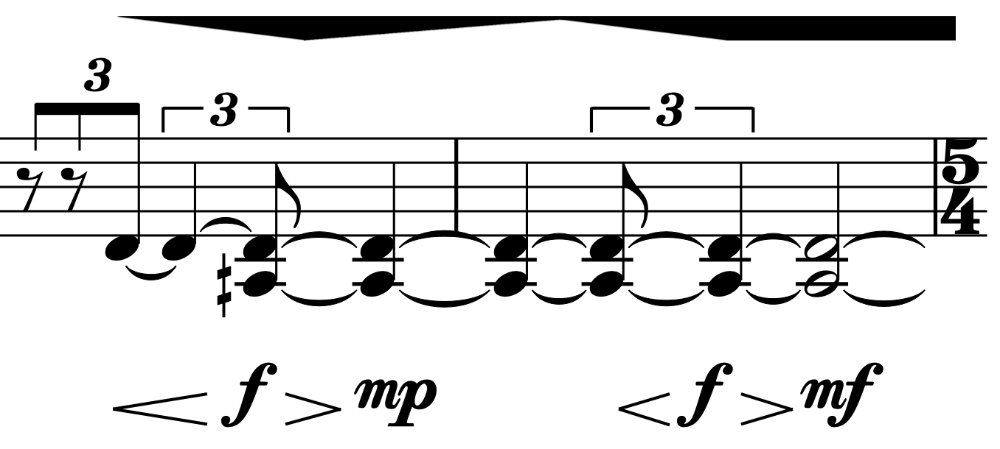
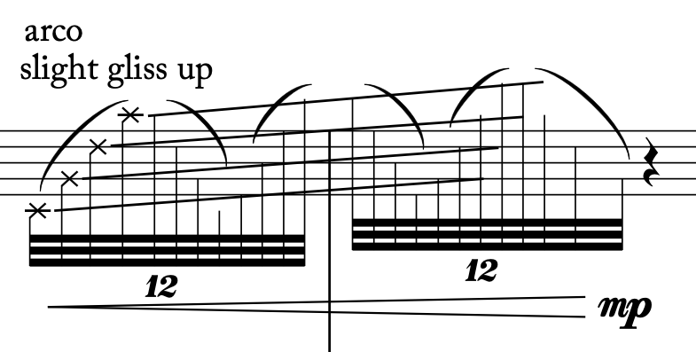
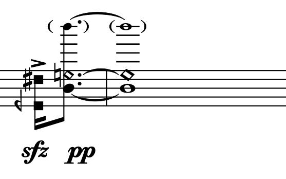
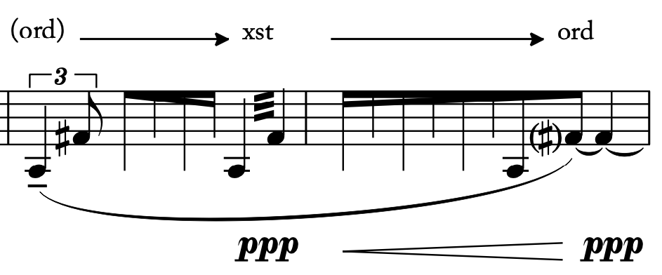
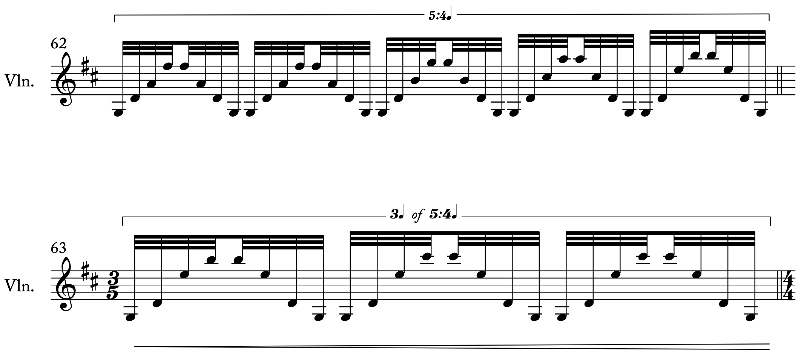

---
header-includes:
  - \usepackage{fancyhdr}
  - \usepackage[top=1in, bottom=1.75in, left=1in, right=1in]{geometry} # Adjust the 'bottom' value as needed
  - \pagestyle{fancy}
  - \fancyhf{}  # Clear header and footer
  - \renewcommand{\headrulewidth}{0pt}  # Remove header line
  - \pagenumbering{roman}
---

\fancypagestyle{firststyle}{\fancyfoot[C]{© Ted Moore 2024 All Rights Reserved\\Squiggly Line Music\\ted@tedmooremusic.com • (952) 484-3997\\ \thepage}}

\thispagestyle{firststyle}

\fancypagestyle{otherpages}{\fancyfoot[C]{\thepage}}
\pagestyle{otherpages}

\setmainfont{Adobe Caslon Pro}

\begin{center}
\fontsize{24pt}{30pt}\selectfont
\textbf{\textit{arco}}

\fontsize{12pt}{18pt}\selectfont
song cycle for violin \& tape in five movements\\
by Ted Moore  
March 2024 • Bethany, CT\\
adapted and extended from \textit{triangle} (2020) for string quartet and tape

dedicated to Marco Fusi
\end{center}

# Performance Instructions for all of *arco* (not all will apply to all movements)

## Movement Selection and Order

Any subset of these movements can be played in any order, including playing a single movement. When a subset of the movements is played, use the movement titles. Listing the movement number and/or piece title (_arco_) is optional. When more than one movement is played, organizing them attaca is optional.

Including video parts is optional. If using the video parts and playing multiple movements, video parts for all those movements should be included. When using the video parts, the projector's image should be as large as possible, thrown onto a wall, preferably a blank white wall with the performer positioned to stand in front of the wall so some of the projection is thrown onto them. A large video screen will also work.

## Blending with the Tape

At many parts in movements II and IV the violin part is composed to blend with the tape in timbre, pitch, rhythm, etc., as a "transcription" of the electronics. The performer should become familiar with the tape, enabling them to lean into the sonic correspondences with the tape during the performance. If there is any part of the score that you (the performing) thinks could be changed slightly (slightly different rhythm, pitch, over pressure amount, etc.) to enhance the correspondence with the tape, go for it.

## Volumes

The violin should never get covered up by the tape part, however, they should be about the same loudness, both feeling full and present in the space. For many performance spaces, this probably means amplifying the violin to match level and blend. For each performance setting, feel free to EQ and/or automate the volume of the tape part to comfortably blend with the violin sound. If someone is available to ride the fader during the performance, this is always appreciated! (If you find that certain sections need to be drastically adjusted, let me know, perhaps those changes should be made in the distributed performance materials!)

## Click Track

Each movement has a click track that can be used to stay aligned with the tape part. It is likely that the click will be most useful for movements II and IV, but can be used for any and all (or not!). All of the media files are aligned so that if one puts the click track and the tape part in a DAW (or any media player) and begins both simultaneously, the click will be properly synchronized with the tape.

\pagebreak
\newgeometry{bottom=1in}

| **Movement** | **Click Track Entrance**           |
| ------------ | -----------------------            |
| I            | one measure before violin entrance |
| II           | 4 beats of count in                |
| III          | one measure before violin entrance |
| IV           | 4 beats of count in                |
| V            | one measure before violin entrance |

## Bow Position

| **Marking in Score**   | **Bow Position**                            |
| ---------------------- | ------------------------------------------  |
| sp                     | sul ponticello                              |
| xsp                    | extreme sul ponticello (_very_ near bridge) |
| st                     | sul tasto                                   |
| xst                    | extreme sul tasto (further over fingerboard)|
| fl                     | flautando                                   |
| ord                    | ordinario                                   |

## Bow Pressure

**Over Pressure**

Solid bars above notes indicate over pressure. Unless specified otherwise, this, "normal" over pressure should create a harsher tone but still have pitch. "Medium over pressure" is slightly more pressure with less pitch. "Extreme over pressure" should be more harsh with little-to-no pitch. Gradations within "normal" over pressure are indicated with wedges.

{ width=3in }

## Note Heads

**`x` note heads** indicate muted strings. These are always used for the same gesture: mute all the strings and bariolage across them quickly with the bow as indicated, following the left hand motion as well. This gesture should be a mostly muted string sound but hopefully some harmonic squeaks or other squeaks will pop out.

{ width=3in }

\pagebreak

**Square note heads** indicate medium overpressure. Some general pitch should be present, but mostly expresses a bow-on-strings crunch sound.

{ width=3in }

## Unmetered Tremolo Transitions

When a feathered beam has no note heads, freely accelerate or ritardando (as indicated) over the specified duration. Continue the note or repetition of notes that started the feathered beam gesture. Focus on the musicality of the gesture over the alloted time rather than the specific number or position of the headless beams.

{ width=3in }

\pagebreak

## Tuplet Continuations

In movement III the bariolage section has varying tuplets, some of which extend for partial measures. When this occurs, continue playing the bariolage in the rhythm of the tuplet for the number of bariolage beats specified and then immediate move to the next measure. In the example below, after playing five quarter note gestures in the time of four quarter notes (in the top measure), continue that rate of quarter notes for three more quarter note beats and then immediately move on to the next measure. The meter and tempo of the click track correctly reflect these jumps.

{ width=3in }

\pagebreak

# _arco_ Tech Rider

contact: Ted Moore (composer) [ted@tedmooremusic.com](mailto:ted@tedmooremusic.com)

_These specifications are adaptable to different performance spaces, so please be in touch with what is or isn't possible and we'll find a solution!_
  
1. Venue provides a stereo speaker configuration for tape playback (more channels are possible, let the composer know ahead of time how many and the configuration).
2. If possible/necessary venue provides a microphone for amplification and blending of acoustic performer with electronic sound. In most halls, amplification of the performer will be beneficial. This microphone should be a condenser microphone, ideally a DPA 4099, DPA 4060, or similar.
3. The performer uses a click track to keep in time with the tape part. Venue provides a female 1/8 inch headphone jack at the performance position for performer to plug earbud(s) into. Venue also provides backup earbuds in case performer requires them.
4. Venue provides playback of click track to audio outputs separate from tape part (so the audience doesn't hear the click track). The tape part and click track audio files are synchronized so that starting them both at the same time will ensure proper synchronization. Synchronization should occur in a digital audio workstation using multiple tracks. Do not attempt to synchronize by ``pushing the buttons at the same time.'' If you require the files organized differently, please get in touch.
5. If including the video designs (this will only be the case if explicitly indicated): Venue provides a projector (as large as possible) thrown onto a wall (preferably a blank white wall with the performer positioned to stand in front of the wall so some of the projection is thrown onto them). A large video screen will also work.

## Tape & Instrument Balance

The violin should never get covered up by the tape part, however, they should be about the same loudness, both feeling full and present in the space. For many performance spaces, this probably means amplifying the violin to match level and blend. For each performance setting, feel free to EQ and/or automate the volume of the tape part to comfortably blend with the violin sound. If someone is available to ride the fader during the performance, this is always appreciated! (If you find that certain sections need to be drastically adjusted, let me know, perhaps those changes should be made in the distributed performance materials!)
